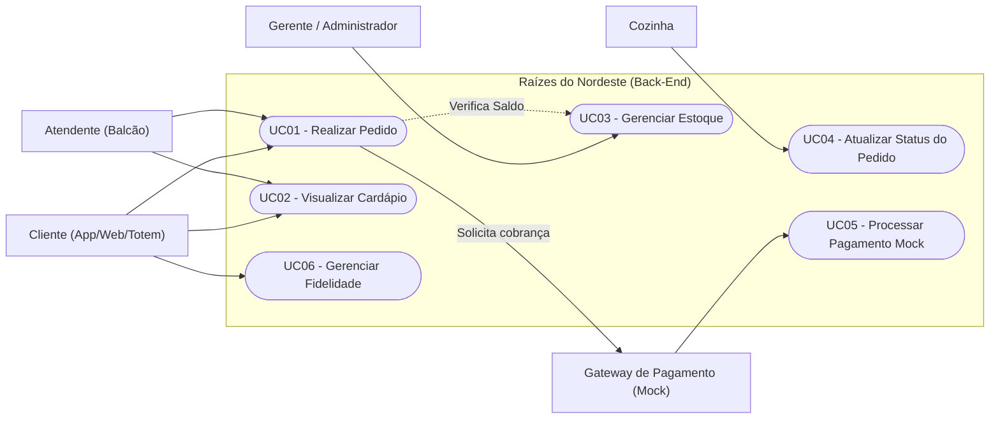
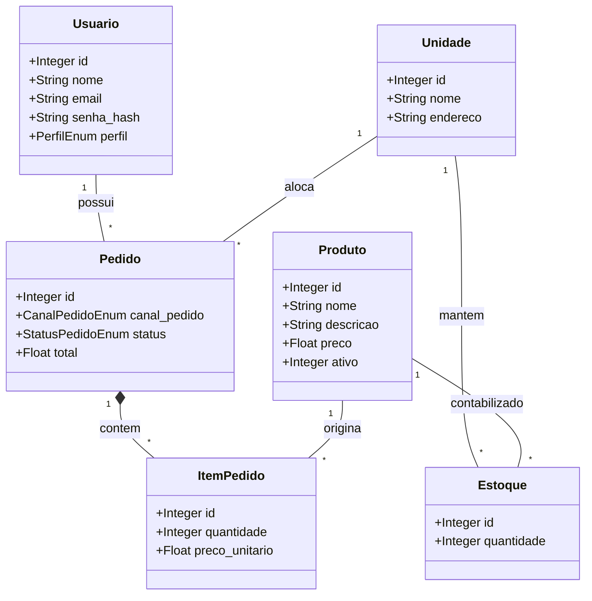
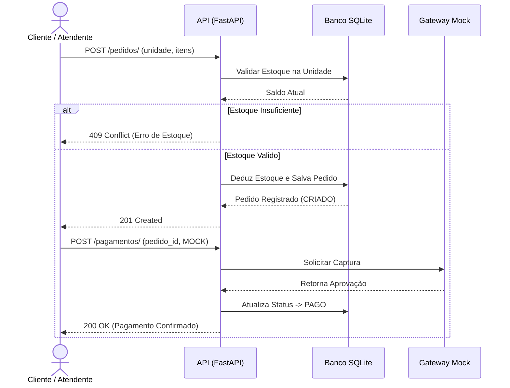

# Projeto Multidisciplinar - Trilha Back-End
## Rede "Raízes do Nordeste"

**Aluno:** Wesley Guimarães Marinho / RU 4736850
**Polo de Apoio:** Polo Araraquara - SP
PROJETO MULTIDISCIPLINAR DE ANÁLISE E DESENVOLVIMENTO DE SISTEMAS
TRILHA: BACK-END
**Professor:** Prof. Me. Luciane Yanase Kanashiro
**Semestre/Ano:** 2026

---

## Sumário
1. Introdução
2. Análise e Requisitos
3. Modelagem e Arquitetura
4. API e Endpoints
5. LGPD, Privacidade e Segurança
6. Entrega Técnica
7. Plano de Testes
8. Conclusão
9. Referências

---

## 1. Introdução
Este trabalho apresenta o desenvolvimento da API (Back-End) para o estudo de caso da rede de lanchonetes "Raízes do Nordeste". Como o negócio está crescendo bastante e possui diferentes unidades, o foco do projeto foi criar um sistema capaz de receber pedidos de vários canais diferentes (App, Totem, Balcão, Web e Retirada) sem perder o controle e a rastreabilidade. 

A ideia foi construir uma arquitetura funcional em Python, permitindo a gestão dos pedidos, o controle do cardápio e simulando a integração com um gateway de pagamentos externo (Mock). Tudo isso pensando em manter o código organizado e aplicar na prática os conceitos vistos durante o curso.

## 2. Análise e Requisitos

### Requisitos Funcionais (RF)
- **RF01:** Cadastro e Autenticação de usuários, diferenciando os perfis em `ADMIN`, `GERENTE` e `CLIENTE`.
- **RF02:** Visualização de cardápio, permitindo a listagem e consulta detalhada de produtos.
- **RF03:** Multicanalidade – O campo `canalPedido` é obrigatório para garantir a rastreabilidade operacional e auditoria entre os diferentes pontos de venda (App, Totem, Balcão, Web, Retirada), conforme regras de negócio da rede.
- **RF04:** Atualização de status de pedido (CRIADO -> PAGO -> COZINHA -> ENTREGUE / CANCELADO).
- **RF05:** Mock de pagamento. O sistema deve validar a forma de pagamento externa, alterando o status caso seja "MOCK" ou simulando recusa.
- **RF06:** Controle de Estoque por Unidade – Bloqueio de vendas caso o estoque da unidade selecionada seja insuficiente, evitando inconsistências no atendimento durante horários de pico.
- **RF07:** Fidelização (base: acumular pontos).

### Requisitos Não Funcionais (RNF)
- **RNF01:** Segurança da informação. Uso de senhas criptografadas (Hash BCRYPT) e JWT (JSON Web Tokens) para as chamadas de API.
- **RNF02:** Aderência à LGPD (coleta mínima de dados, finalidade justificada, hash de senhas e anonimização quando aplicável).
- **RNF03:** Arquitetura limpa/modular (divisão em Routers, Schemas, Models, Services).
- **RNF04:** API totalmente documentada via Swagger/OpenAPI.
- **RNF05:** Padrão uniforme de erro JSON para todos os endpoints.

## 3. Modelagem e Arquitetura

### 3.1. Diagrama de Casos de Uso (Conceitual)
**Atores Identificados e Casos de Uso Obrigatórios:**



### 3.2. Modelo de Dados (DER)

```

### 3.3. Diagrama de Classes (Visão de Domínio)
O diagrama a seguir exibe as entidades, métodos principais e suas multiplicidades dentro do domínio do sistema:



### 3.4. Diagrama de Sequência (Fluxo Crítico)
Fluxo evidenciando a jornada do Pedido → Pagamento Mock → Status:



### 3.3. Arquitetura em Camadas
O projeto utiliza a linguagem Python com o framework FastAPI, estruturando-se em:
- **API/Routers:** Camada de transporte (recebe requests, responde JSON).
- **Schemas:** Definição de contratos (Pydantic models) e validações.
- **Models/Infrastructure:** Definição das tabelas do banco (SQLAlchemy) e conexão.
- **Services/Domínio:** Onde apliquei as regras de negócio (cálculo de total, simulação do mock de pagamento, etc).

## 4. API e Endpoints

Abaixo estão os endpoints documentados conforme exigido no roteiro. A documentação interativa também está no Swagger (`/docs`).

*Padrão de Erro do Sistema:*
```json
{
  "error": "VALIDATION_ERROR",
  "message": "Mensagem detalhada do erro.",
  "timestamp": "2026-06-23T17:00:00Z",
  "path": "/api/exemplo"
}
```

### Checklist de Endpoints

**1. Login (`POST /auth/login`)**
- *Propósito:* Autenticar usuário e retornar JWT.
- *Permissões:* Público.
- *Parâmetros:* Body JSON `{"email": "...", "senha": "..."}`
- *Response (200):* `{"access_token": "...", "token_type": "bearer"}`

**2. Listar Cardápio da Unidade (`GET /unidades/{id}/cardapio`)**
- *Propósito:* Listar os produtos ativos de uma unidade.
- *Permissões:* Público.
- *Parâmetros:* Path param `id` (int).
- *Response (200):* `[{"id": 1, "nome": "Tapioca", "preco": 10.0}]`

**3. Criar Pedido (`POST /pedidos/`)**
- *Propósito:* Registrar uma nova requisição de compra associada a uma unidade e validar os itens.
- *Permissões:* Requer JWT (Perfil: CLIENTE).
- *Payload (Request):* JSON contendo unidadeId, itens (lista de IDs e quantidades) e formaPagamento.
- *Regras de Negócio e Erros:*
  - O campo `canalPedido` é um ENUM obrigatório. Se ausente ou inválido, retorna `422 Unprocessable Entity`.
  - O sistema realiza o double-check do estoque na unidade antes de fechar o pedido. Caso não haja saldo suficiente para qualquer item, a operação é abortada retornando `409 Conflict`.
- *Response (201):* JSON do Pedido criado contendo os detalhes inseridos e `total`.

**4. Atualizar Status do Pedido (`PATCH /pedidos/{id}/status`)**
- *Propósito:* Atualizar o status do pedido (ex: de PAGO para COZINHA).
- *Permissões:* Requer JWT (Bearer).
- *Parâmetros:* Path `id`. Body JSON `{"forma_pagamento": "..."}`
- *Response (200):* `{"detail": "Status atualizado.", "novo_status": "COZINHA"}`

**5. Processar Pagamento Mock (`POST /pagamentos/`)**
- *Propósito:* Simular o gateway de pagamento externo e alterar status para PAGO.
- *Permissões:* Requer JWT (Bearer).
- *Parâmetros:* Body JSON `{"pedido_id": 1, "forma_pagamento": "MOCK"}`
- *Response (200):* `{"detail": "Pagamento simulado com sucesso via Gateway MOCK.", "novo_status": "PAGO"}`

**6. Consultar Saldo Fidelidade (`GET /fidelidade/saldo`)**
- *Propósito:* Checar quantos pontos o usuário possui.
- *Permissões:* Requer JWT.
- *Parâmetros:* Nenhum (usa token).
- *Response (200):* `{"usuario_id": 1, "saldo_pontos": 150}`

**7. Registrar Pontos Fidelidade (`POST /fidelidade/registrar`)**
- *Propósito:* Acumular pontos na conta do cliente ao efetuar compras.
- *Permissões:* Requer JWT.
- *Parâmetros:* Query param `pontos`.
- *Response (200):* `{"detail": "Pontos registrados com sucesso.", "saldo_total": 200}`

**8. Resgatar Pontos Fidelidade (`POST /fidelidade/resgatar`)**
- *Propósito:* Trocar pontos por benefícios.
- *Permissões:* Requer JWT.
- *Parâmetros:* Query param `pontos`.
- *Response (200):* `{"detail": "Pontos resgatados...", "saldo_restante": 50}`

**9. Consultar Estoque Unidade (`GET /estoque/{unidadeId}`)**
- *Propósito:* Visualizar saldos de produtos da unidade.
- *Permissões:* Público (ou Logado).
- *Parâmetros:* Path param `unidadeId`.
- *Response (200):* `[{"produto_id": 1, "quantidade": 50}]`

**10. Movimentar Estoque (`PATCH /estoque/movimentar`)**
- *Propósito:* Realizar entrada/saída de itens.
- *Permissões:* Apenas GERENTE/ADMIN (validação no JWT).
- *Parâmetros:* Body JSON `{"produto_id": 1, "unidade_id": 1, "quantidade": 10}`
- *Response (200):* `{"detail": "Movimentação registrada com sucesso.", "novo_saldo": 60}`

**11. Listar Pedidos (`GET /pedidos/`)**
- *Propósito:* Consultar o histórico de pedidos realizados na rede para fins de auditoria e relatórios.
- *Permissões:* Requer JWT (Perfis: ADMIN, GERENTE).
- *Parâmetros de Busca:* Query param opcional `canalPedido` (ex: `?canalPedido=TOTEM`) para filtrar e segmentar as vendas por canal de origem.
- *Response (200):* Array JSON contendo a listagem dos pedidos filtrados e seus respectivos status.

## 5. LGPD, Privacidade e Segurança no Back-End
Para atender aos requisitos de segurança e LGPD propostos pelo estudo de caso, procurei manter o armazenamento apenas do que é essencial para o fluxo funcionar. 

**Conformidade com a LGPD e Armazenamento**
- *Base Legal:* O tratamento de dados pessoais (Nome, E-mail, CPF) é fundamentado no Consentimento do Titular (Art. 7º, I, LGPD) coletado no momento do cadastro através de aceite explícito dos Termos de Uso.
- *Persistência do Consentimento:* O aceite é registrado na tabela USUARIO através do campo booleano `consentimento_lgpd` (armazenando True e o timestamp da operação), garantindo a rastreabilidade da autorização.

- As senhas dos usuários nunca são salvas abertamente (usei a biblioteca nativa `bcrypt` para salvar apenas o hash no banco).
- Apliquei um esquema de autenticação com tokens JWT.
- Para fins de auditoria, a API gera logs de sistema sempre que uma ação sensível ocorre, como a criação, movimentação de estoque ou a alteração de status de um pedido. Isso garante total rastreabilidade sobre as movimentações e seus autores ("quem fez e quando").
- Rotas de controle sensível exigem que o usuário tenha o perfil de administrador ou gerente.
- Quando um cliente loga, ele consegue listar e visualizar apenas os seus próprios pedidos, evitando expor dados de outras pessoas e garantindo a privacidade.

## 6. Entrega Técnica
- **Código-Fonte e Repositório:** O código encontra-se implementado e pode ser verificado no repositório público: https://github.com/Marinho37/raizes-do-nordeste-api
- **Swagger Local:** Ao rodar a API, acessível via `http://localhost:8000/docs`.
- **Coleção Postman:** Disponibilizada como arquivo no diretório raiz do projeto.
- **README:** Contém as instruções de setup e testes.

## 7. Plano de Testes (Evidências Executáveis)
Os cenários abaixo foram extraídos diretamente da coleção de testes `Raizes_do_Nordeste_Postman_Collection.json` anexada à raiz do repositório público. A suíte cobre autenticação, autorização por perfil, tratamento de erros de validação, regras de negócio críticas e a simulação do gateway de pagamento.

**Tabela de Cenários Mínimos de Validação**

| ID | Cenário / Tipo | Endpoint + Método | Pré-condição | Entrada (Payload/Query) | Esperado (Status + Response) | Evidência na Coleção |
|---|---|---|---|---|---|---|
| **T01** | Login Válido (Positivo) | `POST /auth/login` | Usuário cadastrado no banco via script seed. | `{"email": "admin@raizes.com", "senha": "123"}` | `200 OK` + Retorno do JWT `access_token`. | Auth / Login válido |
| **T02** | Bloqueio Sem Token (Negativo) | `GET /pedidos/` | Chamada sem cabeçalho de autenticação. | Nenhum | `401 Unauthorized` + JSON padrão de erro. | Auth / Acesso Sem Token |
| **T03** | Cadastro de Pedido (Positivo) | `POST /pedidos/` | Usuário logado como CLIENTE; estoque disponível. | `{"canalPedido": "APP", "itens": [{"produto_id": 1, "quantidade": 1}]}` | `201 Created` + Detalhes do pedido gerado. | Pedidos / Criar Pedido |
| **T04** | Validação Multicanal (Negativo) | `POST /pedidos/` | Usuário logado com JWT válido. | `{"itens": [{"produto_id": 1, "quantidade": 2}]}` (Falta canal) | `422 Unprocessable Entity` (Falta de `canalPedido`). | Pedidos / Falta Canal |
| **T05** | Produto Inexistente (Negativo) | `POST /pedidos/` | Usuário logado com JWT válido. | `{"canalPedido": "APP", "itens": [{"produto_id": 999, "quantidade": 1}]}` | `404 Not Found` (Id inválido no domínio). | Pedidos / Produto Inexistente |
| **T06** | Pagamento Mock Aprovado (Positivo) | `PUT /pedidos/1/status` | Pedido ID 1 registrado no sistema como pendente. | `{"forma_pagamento": "MOCK"}` | `200 OK` + Mudança automática do status para `PAGO`. | Pedidos / Pagar MOCK Ok |
| **T07** | Pagamento Mock Recusado (Negativo) | `PUT /pedidos/2/status` | Pedido ID 2 registrado no sistema como pendente. | `{"forma_pagamento": "FALHA"}` | `400`/`409`/`422` + Retorno de falha na transação de crédito. | Pedidos / Pagar MOCK Recusado |
| **T08** | Consulta Saldo Pontos (Positivo) | `GET /fidelidade/saldo` | Cliente logado com perfil válido e histórico de compras. | Nenhum (Identificação extraída do JWT) | `200 OK` + Objeto contendo o saldo de pontos atualizado. | Fidelidade / Consultar Pontos |
| **T09** | Resgate Pontos Insuficiente (Negativo) | `POST /fidelidade/resgatar` | Cliente logado possui pontuação inferior à solicitada. | Query param: `?pontos=200` | `409 Conflict` + Mensagem de saldo insuficiente. | Fidelidade / Saldo Insuficiente |
| **T10** | Permissão por Perfil / RBAC (Negativo) | `PATCH /estoque/movimentar` | Usuário logado com token de escopo restrito (CLIENTE). | `{"produto_id": 1, "unidade_id": 1, "quantidade": 10}` | `403 Forbidden` (Operação exclusiva para Gerente/Admin). | Estoque / Acesso Negado |

🪵 **Registro de Logs e Auditoria (Observação para a Banca)**
Conforme exigido no item 8.3-e do roteiro prático, declara-se que as ações sensíveis disparadas pelos cenários **T03** (Criação de Pedidos), **T06** (Aprovação de Pagamento) e **T10** (Tentativa de alteração de estoque) geram de forma imediata registros de log estruturados no sistema de arquivos ou banco de dados, permitindo auditar o autor da requisição através do ID extraído do token JWT, garantindo total rastreabilidade operacional.
## 8. Conclusão
O desenvolvimento da API "Raízes do Nordeste" permitiu consolidar de forma prática os pilares de arquitetura de software, modelagem de dados e segurança exigidos no ecossistema de Back-End profissional. A priorização técnica concentrou-se na entrega do fluxo crítico estruturado (Pedido -> Pagamento Mock -> Transição de Status) sob uma arquitetura desacoplada em camadas (Domain, Application, Infrastructure e API), garantindo que as regras de negócio permanecessem isoladas das preocupações de infraestrutura e contratos de interface.

Os principais artefatos de modelagem (Diagrama de Casos de Uso, DER e Diagrama de Classes) serviram como fundação direta para o mapeamento das entidades do ORM SQLAlchemy e endpoints expostos, eliminando lacunas de consistência entre o planejamento teórico e a API executável. O requisito mandatório de multicanalidade foi solucionado no domínio por meio do campo obrigatório `canalPedido` (mapeado como ENUM), viabilizando a rastreabilidade operacional de vendas originadas via App, Totem, Balcão, Pickup ou Web.

Do ponto de vista de conformidade com a LGPD e Segurança, os dados pessoais dos clientes foram blindados na persistência através da criptografia de senhas via hash bcrypt, restrição de escopo de leitura baseado em tokens JWT por perfil (Roles) e coleta formal do consentimento atrelada a uma trilha auditável de logs do sistema para ações sensíveis. 

Por fim, a validação completa da API foi comprovada de forma reproduzível por meio de uma bateria de testes cobrindo 10 cenários distintos (6 positivos e 4 negativos), cujas evidências de execução foram documentadas de forma transparente na coleção Postman e no repositório versionado público.

## 9. Referências
- FOWLER, Martin. *UML Essencial: um breve guia para linguagem padrão*. 3. ed. Porto Alegre: Bookman, 2005.
- GAMMA, Erich; HELM, Richard; JOHNSON, Ralph; VLISSIDES, John. *Padrões de projetos: soluções reutilizáveis de software orientados a objetos*. 1. ed. Porto Alegre: Bookman, 2000.
- LEDUR, C. L. *Análise e projeto de sistemas*. 1. ed. Barueri: Manole, 2017.
- PRESSMAN, Roger S.; MAXIM, Bruce R. *Engenharia de Software: Uma abordagem profissional*. 9. ed. Porto Alegre: AMGH, 2021.
- SOMMERVILLE, Ian. *Engenharia de Software*. 10. ed. São Paulo: Pearson, 2018.
